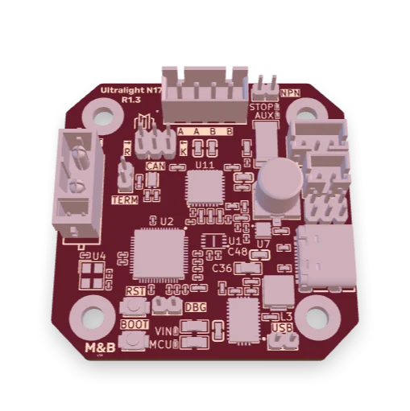
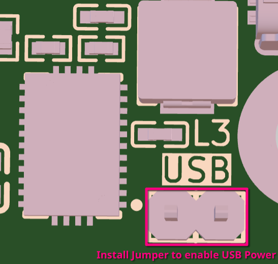

## Introduction

The Ultralight N17 (`UL.N17`) is the first RepRapFirmware and Klipper (TBC) compatible expansion board from Mettle & Byte (MnB), a one-man operation developing software, hardware and firmware for the open source / hobby CNC space.

Developed in collaboration with Millennium Machines, the Ultralight N17 is a CAN / CAN-FD connected motor driver designed to fit onto the back of any NEMA17 size motor.

Initially intended for use on the Millennium Machines rotary toolchanger, the `UL.N17` aims to be a highly versatile expansion option, bypassing mainboard driver limitations, and allowing control of remote motors over significant distances.

The UL.N17 takes inspiration from many open-source hardware projects, and as such, the schematic will be available as well.

## Features

* RP2040 Microcontroller
* 1 x TMC2240 Smart Motor Driver
  * 24v Recommended input voltage (36v absolute maximum)
  * 1A Maximum motor current
  * Overvoltage protection set at 38v, switched by AONR62818 (80v G/S)
  * UART or SPI configuration
  * JST-XH (2.5mm) 4 pin connector
  * DIAG pin connected to RP2040
* General Purpose IO
  * Voltage selectable VIO applies to both Endstop input and Auxiliary output
    * 5v, 12v or VIN
  * All GPIO Optically isolated using EL357N
  * 1 x Endstop input
    * JST-PH (2mm) 3 pin connector
    * NPN / PNP jumper
  * 1 x Auxiliary (PWM) output
    * JST-PH (2mm) 2 pin connector
    * Max 1.5A @ 5v 12v or VIN, ground switched
    * Switched by AONR62818 (80v G/S)
  * LED status indicators (STOP and AUX)
* Texas Instruments based, high efficiency 12v, 5v and 3.3v rails for smooth, reliable power delivery.
* CAN-FD / CANBus connectivity
  * Based on Microchip MCP2518 (Controller) and MCP2542 (Transceiver)
  * Switchable CAN source to Transceiver
    * Either using the MCP2518 controlled over SPI (RRF)
    * or implemented in firmware and RP2040 MCU (Klipper / others)
  * Split bus termination and ESD protected to ±15kV air and ±8kV contact discharges
* User-accessible USB Boot / Reset buttons
* VIN and MCU LED status indicators
* Exposed RP2040 SWCLK and SWD pins

## Configuration

### USB

## Issues

## Motivations

## Thanks
