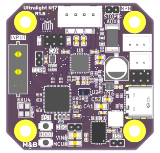

---

## Introduction

The Ultralight N17 is a RepRapFirmware and Klipper compatible expansion board, developed in collaboration with [Millennium Machines](https://github.com/millenniumMachines/).

It uses CAN(-FD) to communicate with RepRapFirmware or Klipper (or anything else for that matter), allowing you to control a single bipolar stepper motor. It exposes one input port for an endstop (3 pin, PH 2.0) and one output port for any auxiliary device, e.g. a fan (2 pin, PH 2.0).

This page covers the **r1.5** version of the board.

---

## Documentation

- **[Pinout Reference](./pinout)** - Essential wiring and connection information
- **[Wiring & Jumpers](./wiring)** - Cable requirements and jumper configuration
- **[Mounting](./mounting)** - Physical installation on your NEMA17 motor
- **[Firmware Configuration](./firmware)** - RepRapFirmware and Klipper setup
- **[Features & Specifications](./features)** - Detailed technical information

---

## Quick Start

1. **[Review the Pinout](./pinout)** - Understand the connections before wiring
2. **[Configure Jumpers](./wiring#jumper-configuration)** - Set up VIO, CAN mode, and termination
3. **[Mount to Motor](./mounting)** - Install on your NEMA17 motor
4. **[Configure Firmware](./firmware)** - Set up RRF or Klipper

---

## Purchase

Buy the Ultralight N17 on [Tindie](https://www.tindie.com/products/mnb/ultralight-n17/).

---

## Thanks
 
 - Everyone on the [Millennium Machines](https://github.com/millenniumMachines/) team for their hard work, and encouragement to take this on myself.
 - `Jay_s_uk` and `Gloomyandy` from [TeamGloomy](https://teamgloomy.github.io/) for their technical assistance and ideas.
 - [DesktopMachineShop](https://www.desktopmachineshop.com/shop) `Dave` for supplying me with endmills that never get used as my Milo is mostly a software development platform at this point!
 - The [Duet3D](https://www.duet3d.com/) team who without which, we would not be running RepRapFirmware on CNC machines.
 - `Allen` from [West3D](https://west3d.com/) for the amazing photos of the board and printed mounts, and for putting it through its paces.