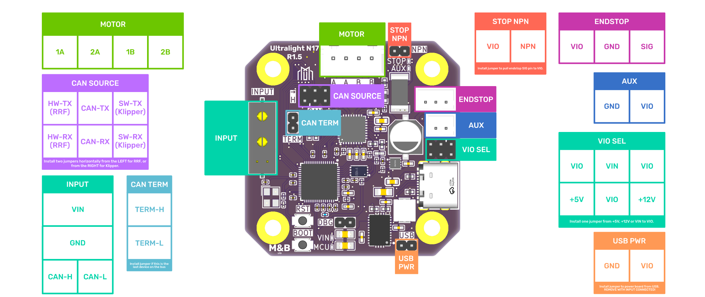

---

[Features](#features) [Installation](#installation) [Pinout](#pinout) [Configuration](#configuration) 

---

## Introduction

The Ultralight N17 is the first RepRapFirmware and Klipper compatible expansion board from Mettle & Byte (MnB).

Developed in collaboration with *Millennium Machines*, the Ultralight N17 is a CAN-FD connected motor driver designed to fit onto the back of any NEMA17 (42mm) size motor, providing enough IO to run a single axis.

Initially designed for use on the Millennium Machines rotary toolchanger, the Ultralight N17 aims to be a highly versatile expansion option, bypassing mainboard driver limitations and allowing control of remote motors with only a 4-wire CAN-FD + Power connection.

It is suitable for use in 3D printers, Laser cutters and any other CNC controlled machine that needs to drive a NEMA17 motor.

The Ultralight N17 takes inspiration from many open-source hardware projects, and as such, the schematic will be available as well. This page covers the **r1.5** version of the board.

---

## Features

### Core Components

* **High Power Microcontroller:** The brains of the operation is a **Raspberry Pi RP2350A**, providing a significant performance uplift over the RP2040 commonly used for RRF / Klipper expansion boards. On RRF, this opens up the possibility of closed-loop control (software dependent and requires a small daughter board, implementation ongoing).
* **Silent & Precise Motor Driver:** Features the **Trinamic TMC2240**, renowned for its silent StealthChop2™ and StealthChop4 technology and precise control at up to 256 microsteps.
* **High-Current Capability:** Up to **3.0A peak motor current**[^1], providing ample power for a wide range of demanding NEMA17 stepper motors.

[^1]: Active cooling required. Drive a 3010 fan using the onboard AUX header and our 3D printed fan mounts!

### Connectivity

* **CAN-FD:** A dedicated CAN-FD interface based on the reliable Microchip **MCP2518FD** controller and **MCP2542WFD** transceiver. All communication is handled via the RP2350's high-speed SPI bus for maximum throughput.
* **Selectable CAN Source:** For software CAN implementations, the **MCP2542WFD** can be jumpered directly to the RP2350. This can be used in combination with Klipper!
* **Dual-Mode Driver Communication:** The TMC2240 can be controlled via **UART** (for drop-in compatibility with existing RRF firmware), but also exposes **SPI** connectivity for more advanced configuration and diagnostics. This will allow SPI compatible drivers to be written in future.
* **Jumper-Selectable Bus Termination:** A simple jumper allows you to add a 120Ω termination resistor if the board is the last device on the CAN bus.

### Onboard I/O

* **Optically Isolated Inputs/Outputs:** Both the endstop input and auxiliary output are optically isolated using **PC3H7B** optocouplers.
* **1 x Endstop Input:** A 3-pin JST-PH connector for endstops, with jumper-selectable support for both NPN and PNP sensor types.
* **1 x Auxiliary Switched Output:** A 2-pin JST-PH connector providing a ground-switched output, capable of handling up to **1.5A**. Ideal for controlling servos or small fans.
* **1 x Expansion Port:** Exposes TMC2240 encoder pins, 4 x GPIO pins from the RP2350 and 3.3v, 5v, 12v and VIN for ultimate flexibility.
* **Encoder Ready:** Header pins are available to connect an external encoder for future closed-loop operation.

### Power & Usability

* **Wide Input Voltage:** Designed to operate on a wide DC input range, from **~14V to 36V**[^2].
* **High-Efficiency Power Delivery:** A multi-stage power system featuring Texas Instruments components throughout ensures stable and efficient power for the MCU, driver, and onboard logic.
* **Onboard Diagnostics:** Status LEDs for main power (`VIN`), MCU activity, endstop (`STOP`), and auxiliary output (`AUX`) provide at-a-glance diagnostics.
* **User Serviceability:** Onboard push buttons for `BOOT` and `RESET`, along with an exposed SWD header for advanced debugging.

[^2]: 36v is the absolute maximum voltage tolerated by the TMC2240 driver. Back EMF from running the motor at this voltage will cause overvoltage events!

---

## Installation
The Ultralight N17 comes with RepRapFirmware installed (the latest stable at time of packaging), so you can get up and running with RRF very quickly.


**IMPORTANT**: ALL DIRECTIONS REFERENCE THE MOTOR AND PCB WITH THE MOTOR CONNECTOR AT 12 O'CLOCK.


### Contents
```
1  x Mettle & Byte Ultralight N17, r1.5
1  x Valcon PH 2.0 connector, 6 pin
1  x Valcon PH 2.0 connector, 4 pin
1  x Valcon PH 2.0 connector, 3 pin
1  x Valcon PH 2.0 connector, 2 pin
1  x Valcon XH 2.5 connector, 4 pin
10 x Valcon PH crimps 
1  x 70mm Motor Cable XH 2.5 to PH 2.0 (crimped but connector not installed)
```

### Not Included
The obvious one - a motor. You will need a NEMA17 bipolar stepper motor (4 wire).

You will need an XT30 2+2 cable. I like the [Mellow Fly CAN Cable](https://www.aliexpress.com/item/1005007527109751.html). 

Optionally, you will also need a fan for active cooling at higher current limits, and an endstop switch of your choice. The fan and endstop will need to be rated for the same voltage - either 5v, 12v or 24v as both ports take their output voltage from the same set of jumpers.

Gdstime make a [3010, 24v fan with a PH 2.0 connector](https://www.aliexpress.com/item/4000256787938.html) that is perfect for active cooling.

It is worth noting that right angle XT30 2+2 cables are probably not compatible with our fan mount, as there is not enough room for the lip on these cables given where the fan is placed.

### Mounting

The Ultralight N17 can be bolted to the back of a NEMA17 motor using our [3D-printable spacer and 3010 fan mount](https://www.printables.com/model/1467100-mnb-ultralight-n17-open-frame-3010-fan-mount-pcb-s). This mounting system looks the part, enables active cooling and helps to organise your cabling.

You will need:

- 2 x M3 Socket-head Cap Screws (SHCS) 5mm longer than the body-length of your motor
- 2 x M3x12mm SHCS
- 1 x 3010 Fan with PH 2.0 connector
- 1 x Printed PCB Mount with Encoder Hole (ASA or ABS)
- 1 x Printed Open Frame Fan Mount (ASA or ABS)

When looking at the back of your motor, remove the top right and bottom left bolts.


**NEVER** remove more than 2 bolts at once as it may cause alignment issues with your motor.


Set the jumpers on the Ultralight N17 up the way you would like, and bolt your fan into the mount using the 2 x M3x12mm SHCS. Ideally, use the top right and bottom left holes of the fan (when looking at the underside of the fan / fan mount) as the top left hole may interfere with the endstop connector.

Do not overtighten these bolts. They just need to thread into the printed part with very little torque required to hold the fan in effectively.

You can push any excess fan cable down the 2 sides of the fan that have a slight gap.

Place the Ultralight N17 onto the spacer board, then plug the endstop and fan connectors in. Plug the motor connector in on both ends.

Put the fan mount on top of the Ultralight N17, aligning the cut-out towards the left hand side to make room for your INPUT (XT30 2+2) cable. 

Push your remaining M3 SHCS through the two mounting holes, using them to hold the 3d printed parts and the board together. Then position the board on the back of your motor, placing the long screws into the empty holes.

Push them in with an allen key until they bottom out and then tighten them into the front plate of the motor.

Again, you do not need much torque here. Too much will snap the fan mount.

Plug in your INPUT connector and use the cable-tie channels in the spacer and fan mount to secure all of the wires.

### RRF Instructions

#### Hardware Configuration

1. On the header marked `CAN`, place 2 jumpers horizontally from the `R` symbol, connecting the two left-most pins to the middle pins.
2. On the header marked `TERM`, place a jumper if this is the last device on the CAN-bus.
3. On the header marked `VIO` (on the back), place a single jumper vertically to select the IO voltage. Placing the jumper in the left-most column selects 5v, in the right-most column selects 12v, and the middle column selects VIN.
4. Connect optional endstop and aux output.
5. Insert XT30 2+2 on connector marked `INPUT`. Double and triple check the polarity of your wiring as reversing this will damage the board.
6. CAN-H is Yellow and CAN-L is White. Connect these into your mainboard or as a (short) spur off your CAN-bus.


**QUADRUPLE CHECK** your `INPUT` polarity. Getting this back to front has a very real chance of killing your board instantly.


#### Firmware Configuration

All expansion boards connected to a single RRF instance must each have a unique CAN address. The Ultralight N17 defaults to address 124. 

If you are configuring multiple boards, power up the unconfigured CAN expansion boards one at a time, leaving all other unconfigured boards unpowered. 

You can then reconfigure the powered on board with a unique address, which allows the next expansion boards to be brought up on address 124.

1. Power up the Ultralight N17.
2. Observe the VIN and MCU LEDs on the board. The VIN LED should be solidly on and the MCU LED should flash twice a second until it synchronises with the mainboard. When synchronised, it will blink once a second at the same time as the mainboard.
3. If the MCU LED does not slow down after a couple of seconds, check your CAN wiring.
4. If the MCU LED slows down, congratulations - your Ultralight N17 has connected to your mainboard.
5. Run `M122 B124` via the console. It should report something similar to the below output:

```gcode
M122 B124
Diagnostics for board 124:
Duet MNBN17R1_5 firmware version 3.6.1+1 (2025-10-19 23:26:22) Clock 150.0MHz
Bootloader ID: RP2350
Never used RAM 472212, free system stack 0 words
Tasks: Move(3,nWait 7,0.0%,136) TMC(2,delaying,1.9%,0) HEAT(2,nWait 6,0.1%,130) CanAsync(5,nWait 4,0.0%,58) CanRecv(3,nWait 1,0.0%,354) CanClock(5,nWait 1,0.0%,336) MAIN(1,running,94.4%,426) IDLE(0,ready,1.4%,24) USBD(2,blocked,0.0%,146) AIN(2,delaying,2.2%,262), total 100.0%
Owned mutexes:
Last reset 00:00:14 ago, cause: unknown not implemented
Last software reset data not available
Moves scheduled 0, hiccups 0 (0.00/0.00ms), segs 0, step errors 0 (types 0x0), maxLate 0 maxPrep 0, ebfmin 0.00 max 0.00
Sync err accum 502, peak jitter -4/26, peak Rx delay 269, resyncs 0/0, no timer interrupt scheduled
VIN voltage: min 23.0, current 23.1, max 23.1
MCU temperature: min 35.4C, current 36.8C, max 37.3C
Driver 0: pos 0, 80.0 steps/mm, standstill, SG min 0, temp 21.4C, read errors 0, write errors 0, ifcnt 10, reads 7051, writes 10, timeouts 0, DMA errors 0
Last sensors broadcast 0x00000000 found 0 135 ticks ago, 0 ordering errs, loop time 0
CAN messages queued 292, send timeouts 0, received 132, lost 0, ignored 0, errs 0, boc 1, free buffers 38, min 38, error reg 0
dup 0, oos 0/0/0/0, rxMotionDelay 0
```

6. Run `M952 B124 A20` to assign the Ultralight N17 to address 20. Teamgloomy and Duet suggest using addresses starting at 20 for expansion boards.
7. Run `M999 B124` to force the Ultralight N17 to reboot onto the new address.
8. Wait for the MCU LED to slow down indicating synchronisation, then run `M122 B20` and verify the diagnostic output looks correct.
9. Congratulations! Your Ultralight N17 is ready for configuration!
10. If you have more than one expansion board, run through these steps again for each board, powering on only one unconfigured board at a time.
11. Once all of your boards are configured on their own addresses, you can configure them as axes in RRF:

```gcode
; Wait for expansion boards to sync with mainboard
G4 S2 

; Physical drive 20.0 (Ultralight N17 #1) goes forwards with default timings
M569 P20.0 S1

; Physical drive 21.0 (Ultralight N17 #2) goes forwards with default timings
M569 P21.0 S1

; Assign Ultralight N17 #1 to X-axis and #2 to Y-axis
M584 X20.0 Y21.0

; Configure microstepping, no interpolation
M350 X32 Y32 I0

; Set steps per mm
M92 X800 Y800

; Set motor currents (mA)
M906 X2000 Y2000

; Set standstill current reduction to 10%
M917 X10 Y10
```

### Klipper Instructions
TBD

---

## Pinout


<a href="./images/mnb-ultralight-n17-r1.5-pinout.png">
</a>

We also maintain an interactive [bill of materials](bom/bom.html) that has most pins and jumpers marked as per the board design. 

Click a component on the front or back of the board to learn more about it. Some components have a description for further information.

There are only 2 necessary connections to use the board. The `INPUT` connector for your VIN and CAN(-FD), and the `MOTOR` connector.

---

## Configuration

Properly configuring your Ultralight N17 is essential for correct operation.

### Jumpers

| Header | Function                   | Comment                                                                                                                                                                                    |
| :----- | :------------------------  | :--------------------                                                                                                                                                                                            |
| `NPN`  | **Endstop Input Type.**    | Install a jumper to configure the `STOP` input for NPN-style (sinking) endstops. Leave the jumper off for PNP (sourcing) endstops.                                                         |
| `VIO`  | **IO Output Voltage.**     | Install a jumper between 5v, 12v or VIN and one of the output pins to set the IO voltage. Applies to `STOP` and `AUX`. ONE JUMPER ONLY!                                                         |
| `CAN`  | **CAN Bus Source.**        | Switches between software (RRF) or software CAN control. Install two horizontal jumpers facing inwards from the H mark for RRF, or two jumpers facing inwards from the S mark for Klipper. |
| `TERM` | **CAN Bus Termination.**   | Install jumper to terminate the CAN bus with 2 x 60Ω resistors if this device is the end of the bus.                                                                                       |

### Driver Communication Mode (UART vs. SPI)

The TMC2240 driver can be controlled via UART or SPI.

*   **Default Mode (UART):** For maximum compatibility, the board defaults to **UART mode**. In your firmware, you only need to define the UART pin for the TMC2240, which is connected to `GPIO1` of the RP2350.
*   **Enabling SPI Mode:** To use the faster SPI interface, you must configure `GPIO29` in your firmware. During your firmware's startup sequence, drive `GPIO29` **LOW**. This will switch the TMC2240 into SPI mode before any communication attempts are made.

## Warnings

### PH 2.0 Connector Strength

Be careful when removing connectors from the PH 2.0 receptacles. These have a rather high locking force and pulling on the connector only can sometimes separate the receptacle from the board. 

It is best to try and hold the receptacle and then pull the connector away from it while pushing slightly backwards, away from the locking tabs at the 'front' of the connector.

If you do find the receptacle comes away from the board when you remove the connector, you can simply push it back on to the pins. Adding a tiny dab of superglue on the underside of the receptacle between the pin holes will help to keep it in place next time.


<!--
## Motivations
(You can fill this section in with the story behind the project)
-->

<!--
## Thanks
(You can fill this section in to thank collaborators)
-->